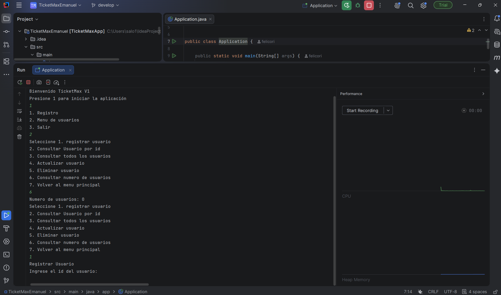
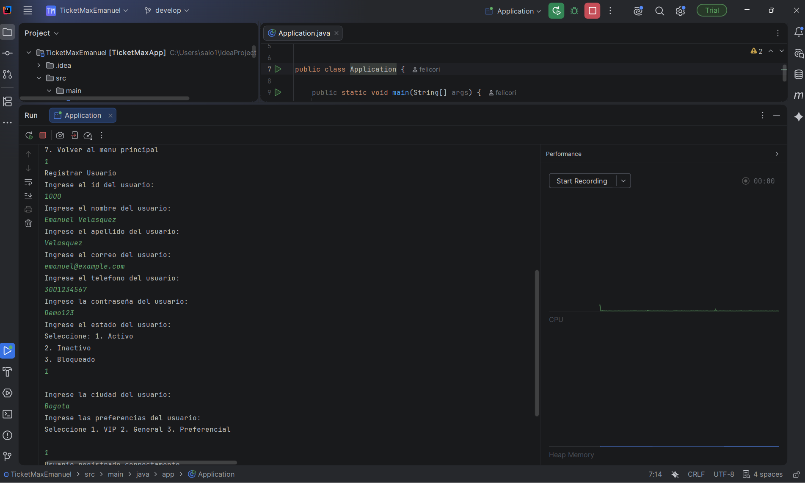
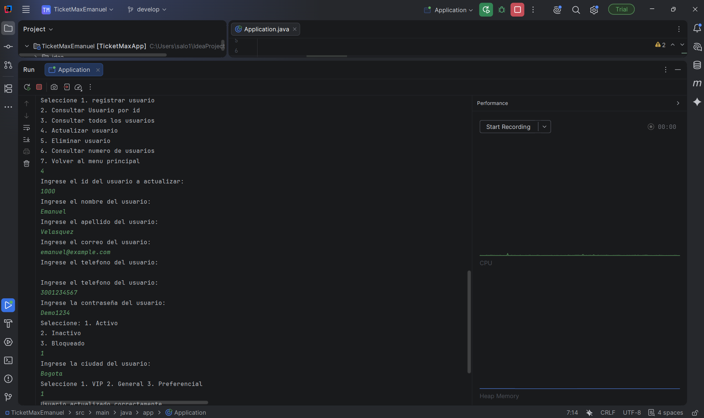
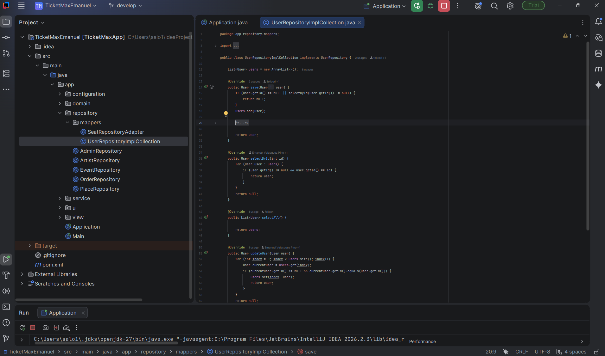
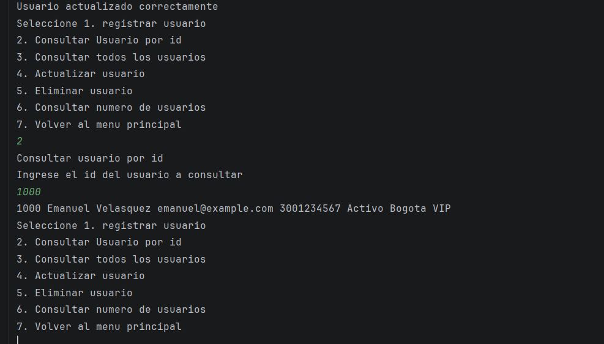
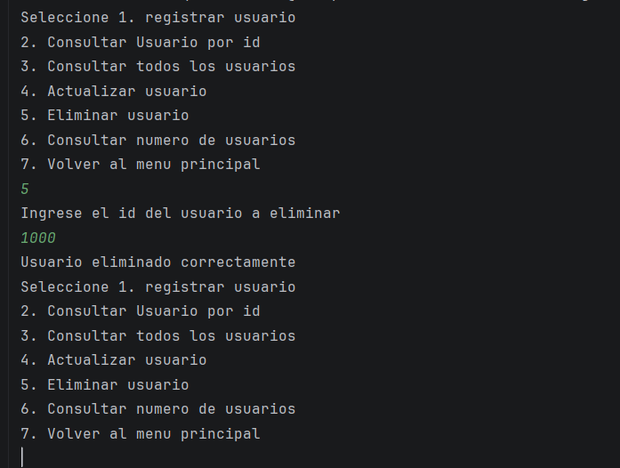
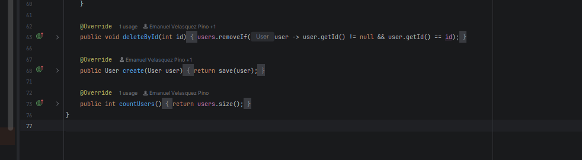
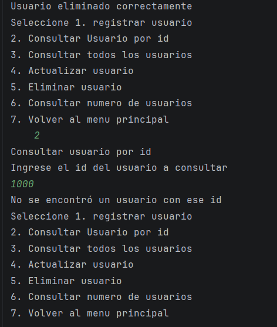
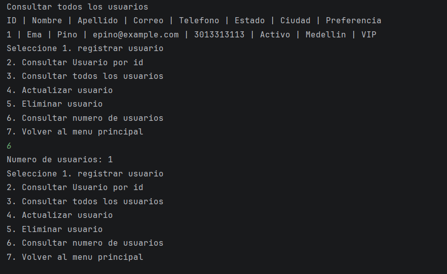

# Evidencias de la vertical User — Ticket Max

**Autor:** Emanuel Velasquez Pino

**Repositorio:** https://github.com/EmanuelVP3/TicketMax_Emanuel

Se implementaron la consulta por ID, la actualización, la eliminación y el conteo de usuarios. Las operaciones están disponibles en el menú de usuarios y usan una colección `ArrayList<User>` en memoria. Los registros se pierden al cerrar la aplicación.

La consulta se expone como `selectUserById()` en el servicio y `selectById()` en el repositorio. La actualización usa `updateUser()` y la eliminación usa `deleteUser()` en el servicio y `deleteById()` en el repositorio. `countUsers()` está declarado en las interfaces de servicio y repositorio y devuelve la cantidad actual de usuarios.

Para ejecutar: abrir `src/main/java/app/Application.java` en IntelliJ IDEA, ejecutar su método `main`, iniciar con 1 y entrar al menú de usuarios con 2.

Las capturas de consulta y eliminación usan el ID 1000. La última captura muestra un registro nuevo con ID 1. El contador inicial es 0 y el contador con ese nuevo registro es 1.

[Descargar documento PDF](entrega-usuarios.pdf)
## Evidencia 1

Menu de usuarios y contador inicial en cero.

## Evidencia 2

Ingreso de datos para registrar el usuario con ID 1000. La confirmacion queda parcialmente cortada.

## Evidencia 3

Ingreso de datos para actualizar el usuario con ID 1000. La confirmacion completa aparece en la evidencia 5.

## Evidencia 4

Implementacion de consulta por ID y actualizacion en UserRepositoryImplCollection.

## Evidencia 5

Confirmacion de actualizacion y consulta posterior del ID 1000: el nombre contiene solo Emanuel, separado del apellido.

## Evidencia 6

Ejecucion de la eliminacion del usuario con ID 1000 y confirmacion del resultado.

## Evidencia 7

Implementacion de deleteById() y countUsers(). El contador devuelve users.size().

## Evidencia 8

Consulta posterior a la eliminacion: el ID 1000 ya no se encuentra.

## Evidencia 9

Listado de un nuevo usuario con ID 1 y consulta del contador: un usuario registrado.

